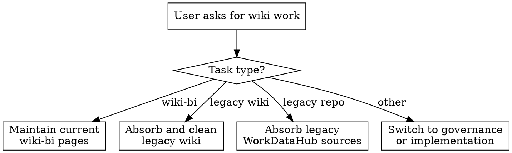

# WDHP Wiki Maintenance

## Overview

Maintain the durable wiki layer for `E:\Projects\WorkDataHubPro` after the user has already chosen wiki work as the boundary.

This skill is narrower than `wdhp-governance`. Use it to execute wiki maintenance work precisely, not to do broad governance review or feature implementation.

## Scope

This skill owns three workflows:

1. Maintain current `docs/wiki-bi/`
2. Absorb and clean former legacy-wiki material
3. Absorb legacy raw sources from `E:\Projects\WorkDataHub`

Use `wdhp-governance` instead when the task is mainly:

- architecture or slice-admission guidance
- implementation review
- deciding whether wiki work should happen at all

Leave this skill when the task becomes actual code, tests, config, or runtime implementation work.

## Canonical Targets

Write durable conclusions to the correct layer:

- `docs/system/`
  - framework-neutral product design and top-level document authority
- `docs/wiki-bi/`
  - business semantics, standards, surfaces, evidence, and durable operator memory
- `docs/superpowers/` or `.planning/`
  - framework-specific workflow or execution material

Treat these as migration or raw-source inputs, not long-term peer knowledge layers:

- former legacy-wiki content
- `E:\Projects\WorkDataHub`

## Workflow Selection

## Minimum Reading Pattern

Load the smallest set that can answer the task.

For `docs/wiki-bi/` maintenance, start with:

- `docs/system/index.md`
- `docs/wiki-bi/index.md`
- the target durable page or pages
- `docs/wiki-bi/log.md`
- one relevant meta doc, usually `docs/wiki-bi/_meta/wiki-design.md` or `docs/wiki-bi/_meta/wiki-absorption-workflow.md`

For former legacy-wiki absorption, start with:

- the specific legacy page or pages being evaluated
- the matching `docs/wiki-bi/` target page or pages
- `docs/wiki-bi/_meta/wiki-design.md`
- `docs/system/` only if the content may belong in top-level design docs instead of the wiki

For legacy `E:\Projects\WorkDataHub` absorption, start with:

- only the specific legacy docs, config, tests, or code paths relevant to the question
- the target `docs/wiki-bi/` page or evidence page
- current repo code/tests/assets only when the task claims a current implementation-backed conclusion

Do not bulk-read former legacy-wiki material, the old repo, or unrelated discipline docs.

## Workflow 1: Maintain `docs/wiki-bi/`

1. Start from current `docs/wiki-bi/` pages, not from legacy material.
2. Decide the filing mode using the query-writeback model from `docs/wiki-bi/_meta/wiki-design.md`:
   - `no-file`
   - `update-existing`
   - `create-synthesis-page`
3. Prefer updating an existing object page over creating a broad duplicate summary.
4. When a durable page changes, update `docs/wiki-bi/index.md` and append `docs/wiki-bi/log.md` in the same pass.
5. When the change comes from real implementation work, verify the current repo and write back evidence as `current_test`, `current_reference_asset`, or `current_runbook` where relevant.
6. When the work is a substantial absorption round, update or create the corresponding file under `docs/wiki-bi/_meta/absorption-rounds/`.

## Workflow 2: Absorb And Clean Former Legacy-Wiki Material

Treat former legacy-wiki material as a migration object, not as a coequal long-lived wiki.

For each legacy page or section, classify content into exactly one of:

- `Stable Finding`
- `Evidence Record`
- `Open Question`
- `Working Trace`

Route the result by destination:

- top-level product design -> `docs/system/`
- business semantics, standards, surfaces, evidence -> `docs/wiki-bi/`
- framework-specific workflow or planning rules -> `docs/superpowers/` or `.planning/`
- duplicated, outdated, or low-value material -> retire, archive, or delete after the durable target is in place

Hard rules:

- Do not copy old pages wholesale.
- Do not recreate the old wiki layer as a parallel primary wiki.
- Rewrite into current `wiki-bi` page types and current terminology.
- Delete or retire old pages only after their durable value has been absorbed or explicitly judged unnecessary.

## Workflow 3: Absorb Legacy `E:\Projects\WorkDataHub`

Treat the old repository as raw source material, not as a repo to mirror.

Focus extraction on:

- stable business semantics
- acceptance standards
- input-reality constraints
- operator artifacts and runtime surfaces
- validation assets and replay evidence

Apply the same four-way classification:

- `Stable Finding` -> main `docs/wiki-bi/` pages
- `Evidence Record` -> `docs/wiki-bi/evidence/`
- `Open Question` -> evidence open-question sections or clearly marked pending material
- `Working Trace` -> keep out of durable wiki pages

Hard rules:

- Do not mirror old directory structure into the wiki.
- Do not translate old pipeline order, hook order, or implementation detail into fake product truth.
- Preserve provenance with concrete legacy paths when writing evidence-backed conclusions.

## Filing Rules

Use these destinations consistently:

- `docs/wiki-bi/concepts/`
  - stable business concepts and semantic constraints
- `docs/wiki-bi/domains/`
  - domain navigation pages, not implementation walkthroughs
- `docs/wiki-bi/surfaces/`
  - operator, runtime, persistence, or artifact surfaces that need explicit governance
- `docs/wiki-bi/standards/`
  - what counts as correct and how correctness is judged
- `docs/wiki-bi/evidence/`
  - source relationships, evidence strength, open questions, supersession
- `docs/wiki-bi/_meta/absorption-rounds/`
  - per-round sediment that gives the next round a clean starting point

Do not create phase-status, roadmap, execution-progress, or changelog-style wiki pages under `docs/wiki-bi/`.

## Completion Checklist

Before claiming the wiki task is complete, check:

- the chosen destination layer is correct
- stable conclusions are separated from open questions
- no duplicate summary page was created unnecessarily
- `docs/wiki-bi/index.md` and `docs/wiki-bi/log.md` were updated when durable pages changed
- cross-links still make sense and no obvious orphan page was introduced
- any removed legacy-wiki content has a clear durable replacement or explicit removal rationale
- any implementation-backed statement was verified against current repo evidence

## Red Flags

Stop and correct course if any of these happen:

- treating former legacy-wiki material as an equal long-term wiki instead of a retirement target
- treating `E:\Projects\WorkDataHub` as something to copy over page by page
- writing open questions into main concept or standard conclusions
- creating new broad summary pages instead of tightening existing object pages
- skipping `index.md` or `log.md` updates after durable changes
- turning implementation mechanics into business-semantic truth
- drifting from wiki work into governance review or implementation without saying so explicitly

## Language Policy

Inside `WorkDataHubPro`, prefer Chinese for wiki writing and maintenance discussion.

Keep paths, filenames, code identifiers, commit messages, and PR text in English unless repository policy changes.
